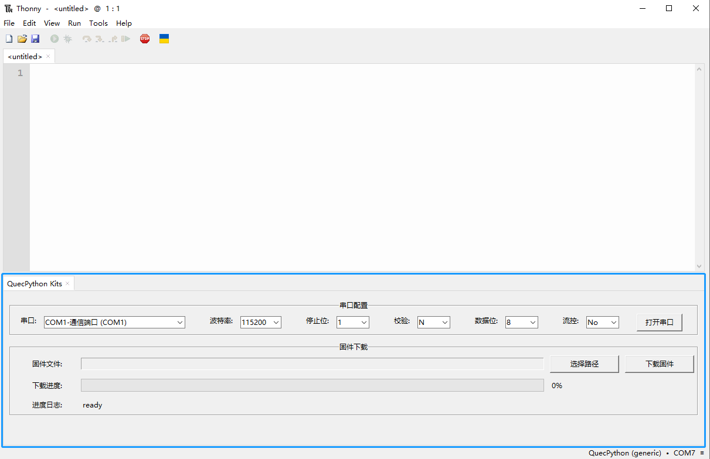

# QuecPython Programing Kits for Thonny

Powered by [QuecPython Group](https://python.quectel.com/), provide support for programming based on the quecpython platform on Thonny. Hereinafter collectively referred to as "**Quecpython Kits**".

## View Display

## Install

### install with pip

now, we just assume you want to install thonny(with Quecpython Kits) on your own python environment(maybe a new virtual environment or a existed one).

if you want to make a new one, you need to run below two steps:

1. make new python virtual environment.

   > shell: `python -m venv {virtual_environment_install_path}`

2. activate your the virtual environment.

   > windows:  `{virtual_environment_install_path}\Scripts\activate`.
   >
   > macos or unix:  `source {virtual_environment_install_path}/bin/activate` .

else you just need to do:

3. install

    > shell: `pip install -i {pypi_site_url} thonny-quecpython`
    >
    > here is some web site for pypi download below, you can choose one.
    >
    > | pypi_site_url                             |
    > | ----------------------------------------- |
    > | http://pypi.douban.com/simple/            |
    > | https://pypi.tuna.tsinghua.edu.cn/simple/ |
    > | http://mirrors.aliyun.com/pypi/simple/    |
    > | https://pypi.mirrors.ustc.edu.cn/simple/  |
    >
    > when you install `thonny-quecpython`, the `thonny>=4.1.1` will be installed automatically.

1. start thonny

   > shell: `python -m thonny`
   > when you start thonny program, it will load plugins automatically(including Quecpython Kits).

### Install with thonny

before installing QuecPython Kits on this way, you need to install Thonny application first.

install using thonny plugin manager from pypi.

1. Go to `Thonny → Tools → Manage plug-ins`
2. Search for `thonny-quecpython`
3. Click `Install`

install manually from local file.

1. Download using the [QuecPython/thonny-quecpython/releases](https://github.com/QuecPython/thonny-quecpython/releases)(wheel or tar package file).
2. Go to  `Thonny → Tools → Manage plug-ins…`
3. Click `Install from local file`
4. Find and select the prefered file.

## Activating Quecpython Kits.

1. After installing, and starting thonny, the Quecpython Kits already loaded.
2. Go to `Thonny → Tools → QuecPython Kits`.
3. or Go to `Thonny → Views → QuecPython Kits`.
4. Select `QuecPython Kits`

## Thonny Open Source

get more infomation about Thonny from: https://github.com/thonny/thonny.